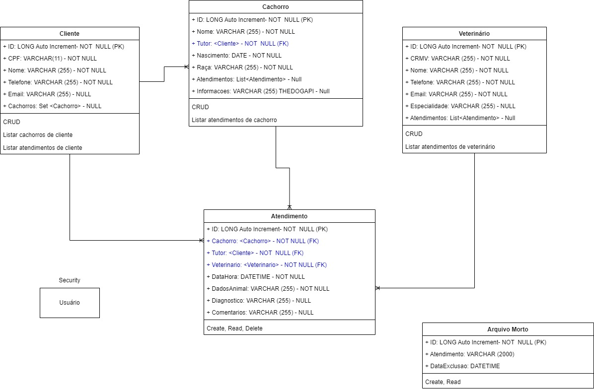

# Desafio API - Clínica Veterinária

>O desafio consiste em desenvolver uma API para uma clínica veterinária.

Para utilizar a API é necessário baixar o projeto Postman e primeiramente logar-se com um dos perfis já cadastrados no endpoint Autenticação > Login. 

>vet1@gft.com (perfil Admin)

>vet2@gft.com (perfil Admin)

>cliente1@email.com (perfil User - Cliente id 1)

>cliente2@email.com (perfil User - Cliente id 2)

>Senha igual para todos: 1234

>O token gerado deve ser utilizado em todas as requisições.

1. Cadastre um cliente
2. Cadastre um cachorro associando-o a algum cliente já existente
3. Cadastre um veterinário e por último, cadastre o atendimento, sempre associado a um animal e a um veterinário. 

Todas as ações estão associadas a um endpoint específico. Consultar e utilizar todos os endpoints via Postman. 

Ao rodar a API pela primeira vez, o programa cria as tabelas automaticamente na base de dados. Essa base de dados também é preenchida automaticamente utilizando o flyway.

#### Tecnologias Utilizadas

- Java 17.0.3.1
- IDE: Spring Tool Suite 4
- MySql Database
- Spring Boot 2.7.1
- Spring Web
- Spring Data JPA
- Spring Security
- Flyway Migration
- Postman

## Funcionalidades implementadas
* CRUD para clientes
    * [x] Create (cria-se um cliente sem nenhum cachorro associado por padrão)    
    * [x] Read (retorna todos os clientes e seus dados pessoais sem a lista de cachorros associado)    
    * [x] Update (pode-se alterar apenas os dados pessoais do cliente,mas não se pode alterar o cachorro associado e nem adicionar novos cachorros por esse endpoint)
    * [x] Delete (Deleta-se o cliente, os relacionamentos e todos os cachorros a ele associados, visto que não é possível existir cachorro sem cliente. Não é possível deletar clientes associados a atendimentos. Para isso é necessário deletar primeiro o atendimento.)

    * [x] Buscar cliente por id
    * [x] Buscar cliente por nome (busca cliente pelo nome ou parte dele)
    * [x] Listar todos os cachorros do cliente (por id de cliente)
    * [x] Listar atendimentos de todos os cachorros do cliente (por id de cliente)

* CRUD para cachorros
    * [x] Create (cria-se um cachorro sempre atrelado a algum cliente, sem atendimentos)    
    * [x] Read (retorna todos os cachorros e seus dados cadastrados, bem como os dados do seu tutor)    
    * [x] Update (pode-se alterar os dados do cachorro, inclusive mudar de dono)
    * [x] Delete (Deleta-se o cachorro, o relacionamento, mas o cliente persiste. Não é possível deletar cachorros associados a atendimentos. Para isso é necessário deletar primeiro o atendimento.)
    
    * [x] Buscar cachorro por id
    * [x] Listar atendimentos de cachorros por id
    * [x] Buscar cachorro por nome (localiza cachorros por nome ou parte dele)

* CRUD para médicos veterinários
    * [x] Create (cria-se um veterinário, sem atendimentos)    
    * [x] Read (retorna todos os veterinários e seus dados cadastrados)    
    * [x] Update (pode-se alterar os dados do veterinário)
    * [x] Delete (Deleta-se o veterinário. Não é possível deletar veterinários associados a atendimentos. Para isso é necessário deletar primeiro o atendimento.)
    
    * [x] Buscar veterinário por id
    * [x] Listar atendimentos por id de Veterinário
    * [x] Buscar veterinário por nome ou parte dele
	
* Atendimento
	* [x] Create
	* [x] Read
	* [x] Delete (Ao deletar um atendimento, os relacionamentos são extintos, porém um registro com todos os dados do atendimento é guardado no arquivo morto)
	
* Arquivo Morto
	* [x] Create (criado automaticamente ao deletar um atendimento)
	* [x] Read (ver todos ou por ID)

* [x] Popular o banco

* [x] Autenticação de usuários para utilizar os endpoints

* [x] Autorizações específicas para clientes(User) e veterinários(Admin). Detalhes podem ser consultados na documentação do Postman.

#### Exceeds

- [x] Tratamento de erros e Exceções personalizadas: impossível cadastrar cliente com CPF já cadastrado na base de dados; impossível cadastrar veterinário com CRMV já cadastrado na base de dados; Resposta personalizada para 'cliente não encontrado', 'cachorro não encontrado', 'veterinário não encontrado' nas buscas e um genérico 'registro não encontrado';  
- [x] Lista de cachorros em cliente
- [x] Lista de atendimentos por cachorro, por cliente e por veterinário
- [x] Arquivo Morto
- [x] Security com JWT
- [x] Projeto Postman

#### Meta

>Autor: Larissa Pereira Rocha – larissa.rocha@gft.com